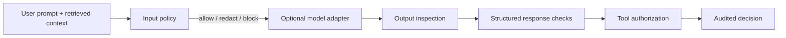

# LLM Firewall and RAG/Agent Security Evaluation Lab

[](https://github.com/niketkrishnan/llm-firewall-rag-security-lab/actions/workflows/ci.yml)

This lab treats an LLM application as a **policy boundary**, not as a trusted black box. It checks untrusted context before generation, redacts canaries and secrets, inspects output, validates structured responses, and constrains tool arguments before any downstream integration is allowed.

## What the checked-in corpus shows

The local authorized corpus contains **7 cases**, including **4 attack cases**. The current policy run blocks all 4 attack cases, blocks 0 benign cases, and records 100% accuracy on this small corpus. Those values are fixture evidence only; they are not a claim that any model or firewall is universally safe.

| Measure | Local result |
| --- | ---: |
| Corpus cases | 7 |
| Attack cases | 4 |
| Attack block rate | 100% |
| Benign block rate | 0% |
| Accuracy | 100% |

Inspect [`artifacts/evaluation.json`](artifacts/evaluation.json) for the case-level decisions, redactions, reasons, and tool authorization output.

## Run the lab

```bash
python -m pip install -e '.[dev]'
python evaluate.py
pytest
```

The default path deliberately uses local policy logic and does not require an LLM API key. That makes the security contract reproducible and keeps the model integration optional.

## Control-plane architecture



The project’s useful design question is not “can the model refuse this prompt?” but “which trust decision was made at each boundary, and can an analyst inspect the reason?”

## OWASP-oriented test map

| Threat surface | Test evidence |
| --- | --- |
| Direct and indirect prompt injection | Input policy and active-content cases |
| Sensitive information disclosure | Canary and secret redaction cases |
| Excessive agency | Tool allowlist and argument checks |
| Unreliable downstream behavior | Structured-output validation |

## Safe extension point

A real model adapter can sit behind the input policy and before output inspection, but it must remain optional, authenticated, rate-limited, and excluded from the default test path. The lab does not execute tools, send messages, or connect to production systems.

## Related work

- [Explainable AI SOC Detection](https://github.com/niketkrishnan/explainable-ai-soc) — evidence-first detection and triage.
- [Cloud Attack-Path Prioritizer](https://github.com/niketkrishnan/cloud-attack-path-prioritizer) — graph reasoning over cloud trust paths.
- [SBOM Supply-Chain Intelligence](https://github.com/niketkrishnan/sbom-supply-chain-intelligence) — policy decisions that developers can act on.
- [Identity Compromise Detector](https://github.com/niketkrishnan/identity-compromise-detector) — privacy-safe risk explanations.
- [Portfolio site](https://github.com/niketkrishnan/HTML-Website) — recruiter-facing overview.

For security concerns, use a private GitHub Security Advisory or contact [@niketkrishnan](https://github.com/niketkrishnan). Keep real secrets and production prompts out of public issues.
